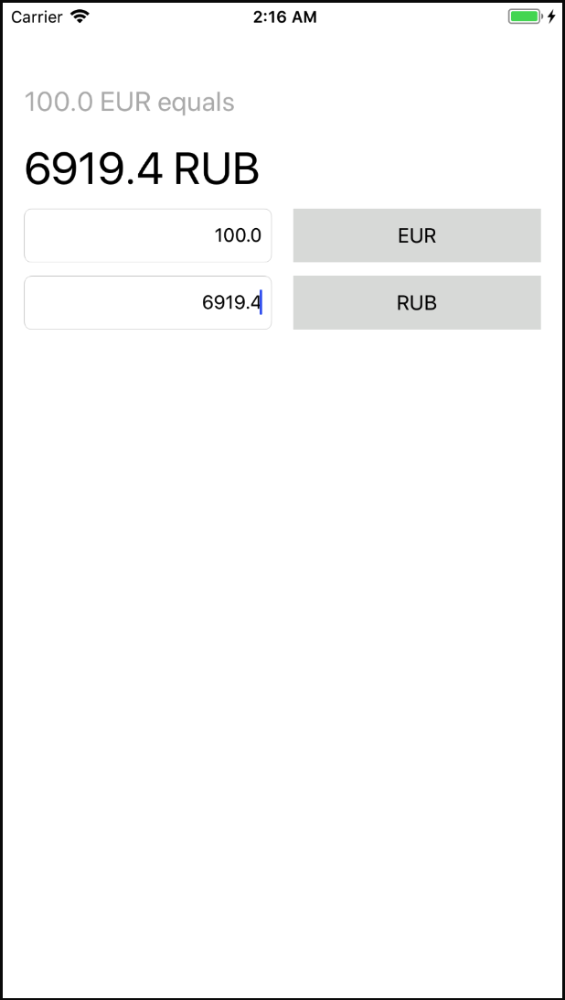

# CurrencyConverter
-Simple iOS application which converts from one currency to another using the API from http://fixer.io/ to retrieve the currency rates.
- application was implemented with MVP pattern(it was not necessary for current version, but it is better for testing and in case of future growth it will allow us to avoid Massive View Controller).
- Modules communicate by protocols, dependency injections by setters and constructors. 
- One Storyboard(with base for expand). UI built by Interface builder, constraints by Autolayout.
- No segues. 
- Rates data provider module can be replaced by another one - we need only conform to protocol.

